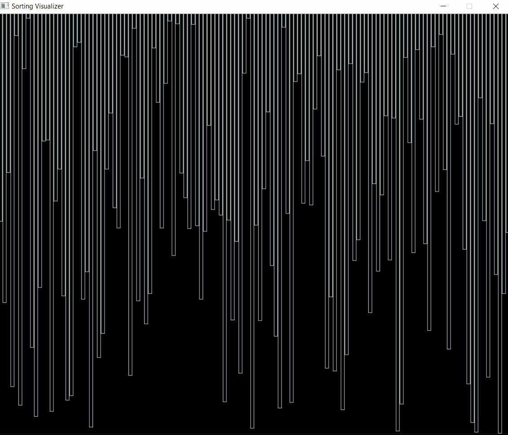

# **Sorting Visualizer**

**Sorting Visualizer** is a desktop-based application built using **C++** and **SDL2**, designed to visually demonstrate various sorting algorithms. This project aims to help users understand sorting algorithms through graphical animations, showcasing how the elements in an array are rearranged step by step.

---

## **Key Features**

### **Algorithm Visualization**:
- Visual representation of sorting steps for better understanding.
- Displays comparisons, swaps, and sorted elements in real-time.

### **Supported Sorting Algorithms**:
- **Bubble Sort**
- **Selection Sort**
- **Insertion Sort**
- **Merge Sort**
- **Quick Sort**
- **Heap Sort**

### **Customizable Array**:
- Generate arrays with different sizes and value ranges.
- Dynamic rendering of array bars to match the input size.

### **Interactive Controls**:
- Start, pause, and reset the visualization.
- Adjust the speed of the animation for better observation.

### **Educational Insights**:
- Highlights the active elements being compared or swapped.
- Provides time complexity details for each algorithm.

### **Cross-Platform Support**:
- Works on Windows, Linux, and macOS with SDL2.

---

## **How to Use**

1. **Install SDL2**:
   - On Ubuntu: `sudo apt install libsdl2-dev`
   - On Windows: Download and configure from [SDL2 website](https://www.libsdl.org/download-2.0.php).
   - On macOS: `brew install sdl2`

2. **Compile and Run**:
   - Use a C++ compiler (e.g., GCC) to build the project.
   - Example command:
     ```bash
     g++ -o sorting_visualizer sorting_visualizer.cpp -lSDL2 -std=c++17
     ./sorting_visualizer
     ```

3. **Controls**:
4. 
   Available Controls inside Sorting Visualizer:-

   -Use 0 to Generate a different randomized list.

   -Use 1 to start Selection Sort Algorithm.

   -Use 2 to start Insertion Sort Algorithm.

   -Use 3 to start Bubble Sort Algorithm.

   -Use 4 to start Merge Sort Algorithm.

   -Use 5 to start Quick Sort Algorithm.

   -Use 6 to start Heap Sort Algorithm.

   -Use q to exit out of Sorting Visualizer

---
## **Sample Screenshot**

# Technology Used:
-C++: Core logic for sorting algorithms and application structure.

-SDL2: Graphics library for rendering and window management.

